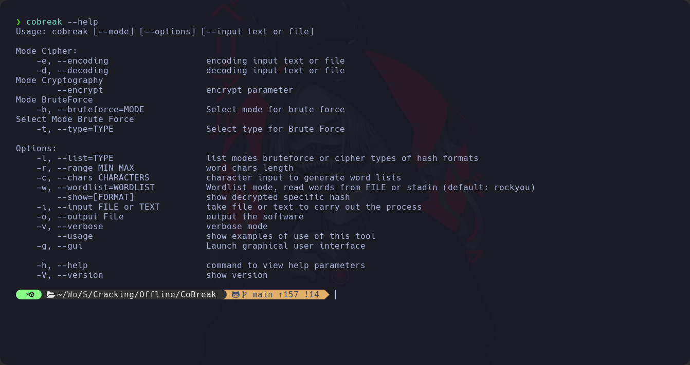
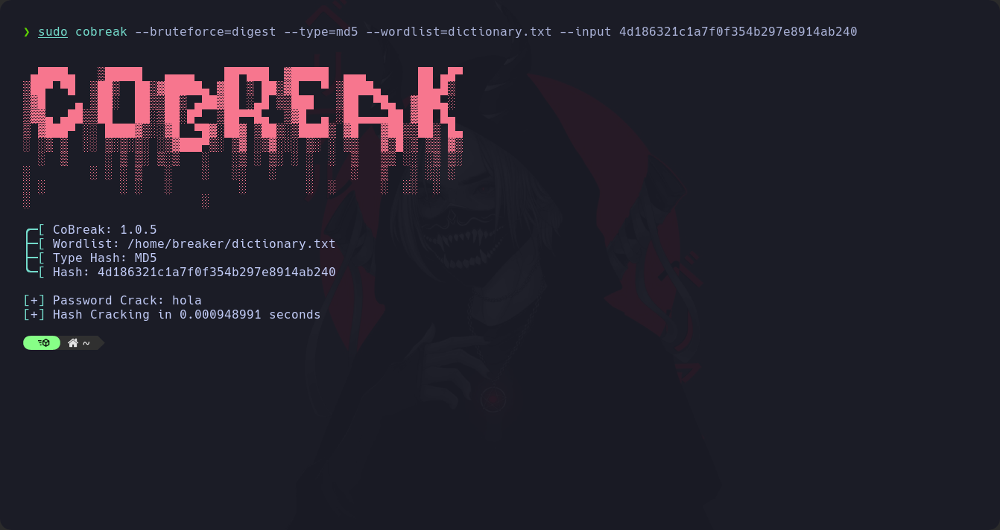
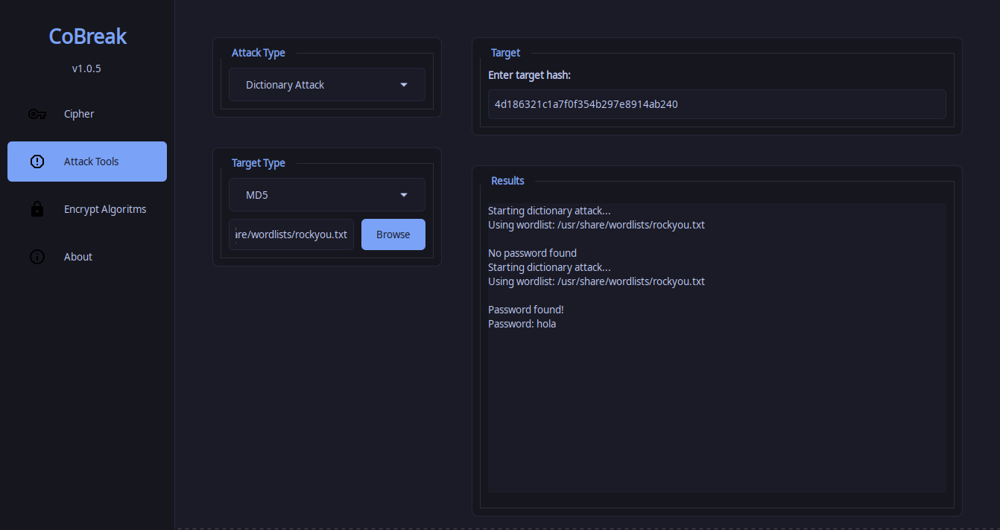

# CoBreak

[`CoBreak.com`](https://github.com/BreakingTWS/CoBreak.git)

This script was made by [`Breaker`](https://github.com/BreakingTWS/CoBreak.git)

CoBreak is a password security audit and recovery tool available for many operating systems. CoBreak supports various types of cipher and hashing for the purpose of facilitating data encryption or other

# GitHub Stats

<h1> Installation</h2>

<h3> Cipher</h3>

 - Base64
 - Base32
 - Base16
 - Ascii85
 - Cesar
 - Binaries

<h3> Raw-Hash</h3>

 - MD4
 - MD5
 - Half-MD5
 - SHA-1
 - Double-SHA1
 - SHA2-224
 - SHA2-256
 - SHA2-384
 - SHA2-512
 - SHA3-224
 - SHA3-256
 - SHA3-384
 - SHA3-512
 - Ripemd-160
 - Tiger-160
 - Blake2s-128
 - Blake2s-160
 - Blake2s-256
 - Blake2b-160
 - Blake2b-256
 - Blake2b-384
 - Blake2b-512
 - GOST R 34.11-2012 (Streebog) 256-bit, big-endian
 - GOST R 34.11-2012 (Streebog) 512-bit, big-endian

<h1>Setup</h1>
---
<h2>Execute in your terminal for build ruby gem and installation:</h2>

<h3>Build ruby gem:</h3>

> $ **gem build cobreak.gemspec**

<h3>And after install ruby gem:</h3>

> $ **sudo gem install ./cobreak-1.0.5.gem**
---

<h1>Usage:</h1>
---
<h2>Help to CoBreak CLI</h2>

> $ **cobreak --help**

<h2>Attack Dictionary CLI</h2>

> $ **sudo cobreak --bruteforce=digest --type=md5 --wordlist=dictionary.txt --input 4d186321c1a7f0f354b297e8914ab240**

<h2>Attack Dictionary GUI</h2>

---

<h1></h1>

# Version
## CoBreak

# License

This project is licensed under the (GNU GENERAL PUBLIC LICENSE) - see the [LICENSE](LICENSE) file for details

